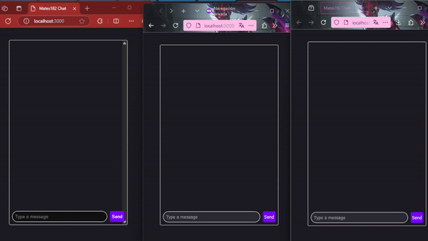

# 🗨️ WebSocket Chat with JavaScript  
A simple group chat application using **Socket.IO** and **Express**. Each browser session (including incognito mode) is assigned a unique username to simulate multiple users. 

## 📋 Features  
- Real-time group chat functionality.  
- Automatic user assignment via random usernames.  
- Unique user instances for every new browser or incognito session.  
- Messages color-coded by username for better readability.  

## 🚀 Getting Started  

### Clone the Repository  
```bash
git clone https://github.com/Mates182/JS.WebSocket-Chat.git
```
```bash
cd JS.WebSocket-Chat
```

### Install Dependencies  
Make sure you have **Node.js** installed. Then, run:  
```bash
npm install
```

### Start the Server  
To run the application in development mode:  
```bash
npm run dev
```

### Access the Application  
Open your browser and navigate to:  
```text
http://localhost:3000
```

## 🛠️ How It Works  
1. **Unique Users**:  
   - Each browser or incognito session is treated as a new user.  
   - Usernames are fetched randomly from the [Random Data API](https://random-data-api.com/).  

2. **Message Broadcasting**:  
   - Messages are sent via WebSocket and displayed in real time to all connected users.  

3. **User-Specific Styling**:  
   - Usernames are color-coded using a hash function for better identification in the chat.  

## 🗂️ Project Structure  
```plaintext
.
├── server/
│   ├── index.js  # Main server file with Express and Socket.IO
├── client/
│   ├── index.html  # Chat UI
│   ├── socket.js   # Client-side Socket.IO logic
│   ├── style.css   # Stylesheet for Chat UI
```

## ✨ Example Usage  
1. Open multiple browser tabs or incognito windows and navigate to `http://localhost:3000`.  
2. Start typing messages in one tab to see them broadcast to others in real time.  

### Example Message Flow:  


Messages will appear instantly in all connected tabs.  
